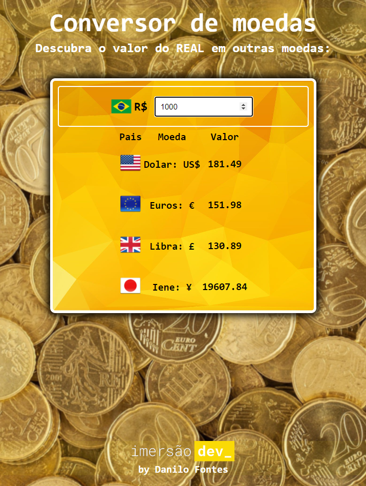

# Conversor de moedas

<h2>Converte Real (moeda brasileira) em Dólares, Euros, Libras Esterlinas e Ienes.</h2>
Aplicação desenvolvida na aula 01 da ImersãoDev da [Alura](https://www.alura.com.br/)

# Currency converter

<h2>Converts Real (Brazilian currency) into Dollars, Euros, British Pounds and Yen.</h2>
Application desenvolved in the first class from ImersãoDev from [Alura](https://www.alura.com.br/)

